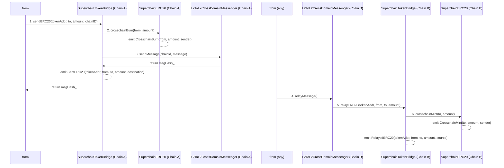

# Superchain Starter Kit: InitialSupplySuperchainERC20

> Generated from [superchain-starter](https://github.com/ethereum-optimism/superchain-starter). See the original repository for a more detailed development guide.
> 
> SuperchainERC20s can be deployed on any chain, but will only be interoperable within the [Superchain interop cluster](https://docs.optimism.io/stack/interop/explainer#superchain-interop-cluster).

Example SuperchainERC20 token (contract + frontend) implementation. The frontend includes a simple bridge interface & event log viewer to see the flow funds.


## 📝 Overview

InitialSupplySuperchainERC20 is a SuperchainERC20-compatible token that implements a "home chain" minting model. The contract:

1. Mints the entire token supply once on a designated "home chain"
2. Can be deployed across multiple chains at the same address
3. Allows tokens to be bridged between chains using standard SuperchainERC20 mechanisms

## 🔗 Contracts

### [InitialSupplySuperchainERC20.sol](./contracts/src/InitialSupplySuperchainERC20.sol)

- An implementation of [SuperchainERC20](https://specs.optimism.io/interop/token-bridging.html#superchainerc20-standard)
- Uses a solady implementation of the token
- Mints initial supply to the owner on a "home chain"
- Contract can be deployed to other chains on the same address, but no new liquidity will be minted

## 🚀 Getting started

### Prerequisites: Foundry & Node

Follow [this guide](https://book.getfoundry.sh/getting-started/installation) to install Foundry

### 1. Create a new repository using this template:

Click the "Use this template" button above on GitHub, or [generate directly](https://github.com/new?template_name=superchain-starter&template_owner=ethereum-optimism)

### 2. Clone your new repository

```bash
git clone <your-new-repository-url>
cd superchain-starter-initial-supply-token
```

### 3. Install dependencies

```bash
pnpm i
```

### 4. Get started

```bash
pnpm dev
```

This command will:

- Start a local Superchain network (1 L1 chain and 2 L2 chains) using [supersim](https://github.com/ethereum-optimism/supersim)
- Launch the frontend development server at (http://localhost:5173)
- Deploy the tokens all of the L2 chains in the local network

Start building on the Superchain!


## 🤔 What is SuperchainERC20?

`SuperchainERC20` is an implementation of [ERC-7802](https://ethereum-magicians.org/t/erc-7802-crosschain-token-interface/21508) designed to enable asset interoperability in the Superchain.
`SuperchainERC20` tokens are fungible across the Superchain by giving the `SuperchainERC20Bridge` permission to mint and burn the token during cross-chain transfers. For more information on SuperchainERC20 please visit the [docs](https://docs.optimism.io/stack/interop/superchain-erc20).

**Note**: ERC20 tokens that do not utilize the `SuperchainERC20Bridge` for cross-chain transfers can still achieve fungibility across the Superchain through interop message passing with a custom bridge solution. For these custom tokens, implementing [ERC-7802](https://ethereum-magicians.org/t/erc-7802-crosschain-token-interface/21508) is strongly recommended, as it unifies cross-chain mint and burn interfaces, enabling tokens to benefit from a standardized approach to cross-chain transfers.

### `IERC7802`

To achieve cross-chain functionality, the `SuperchainERC20` standard incorporates the `IERC7802` interface, defining essential functions and events:

- **`crosschainMint`**: Mints tokens on the destination chain as part of a cross-chain transfer.
- **`crosschainBurn`**: Burns tokens on the source chain to facilitate the transfer.
- **Events (`CrosschainMint` and `CrosschainBurn`)**: Emit when tokens are minted or burned, enabling transparent tracking of cross-chain transactions.

## 🎯 Patterns

### 1. Deterministic addresses & constructor arguments using CREATE2

[SuperchainERC20](https://specs.optimism.io/interop/token-bridging.html#superchainerc20-standard:~:text=and%20crosschainBurn.-,Be%20deployed,-at%20the%20same) standard requires that the contact be deployed on the same address across multiple chains.

A pattern for achieving deterministic addresses is using CREATE2. The CREATE2 deterministic address depends on

1. deployer address
2. salt value
3. init code

#### 1. deployer address

A common practice for keeping a stable deployer address across deploys is to use a well known CREATE2 deployer that is available on every chain. Every OP Stack chain includes the following deployers as [preinstalls](https://specs.optimism.io/protocol/preinstalls.html) by default.

- [Create2Deployer](https://specs.optimism.io/protocol/preinstalls.html#create2deployer)
- [CreateX](https://specs.optimism.io/protocol/preinstalls.html#createx) - this is what super-cli `sup` uses under the hood
- [Arachnid's Deterministic Deployment Proxy](https://specs.optimism.io/protocol/preinstalls.html#arachnids-deterministic-deployment-proxy) - note this is the default CREATE2 deployer used by Foundry

#### 2. init code

The contract's `init code` consists of constructor code, arguments, and bytecode. To achieve identical addresses across chains, the constructor arguments must be exactly the same on every deployment. This consistency is maintained by passing the same values for `owner_`, `name_`, `symbol_`, `decimals_`, `initialSupply_`, and `initialSupplyChainId_` on all chains. The supply minting logic is then handled at runtime using `block.chainid`:

#### 3. salt value

The optional salt value can be specified. This is easy to keep consistent. If you ever lose it, you will be able to recover it by tracing the deploy transaction.

By keeping the above parameters constant, CREATE2 will generate identical contract addresses across all chains, satisfying the SuperchainERC20 standard's same-address requirement

#### Alternative patterns

<details>
<summary>Click to see</summary>

- Reserving nonces on an EOA then sending a CREATE1 transaction
  - This requires careful nonce management across all chains
  - More prone to errors if transactions are sent out of order
- Using a proxy pattern with an implementation contract
  - Deploy a proxy contract at a deterministic address (still using CREATE2)
  - The implementation contract can be deployed at different addresses on each chain
  - The proxy delegates all calls to the implementation

</details>

### 2. Supply management with `_initialSupplyChainId`

The constructor uses a runtime check to ensure tokens are only minted on the designated home chain:

```solidity
constructor(
    address owner_,
    string memory name_,
    string memory symbol_,
    uint8 decimals_,
    uint256 initialSupply_,
    uint256 initialSupplyChainId_
) {
    if (initialSupplyChainId_ == block.chainid) {
        _mint(owner_, initialSupply_);
    }
}
```

This approach maintains the same contract address across chains while preventing accidental supply inflation.

### 3. Implementing the ERC-7802 interface for compatibility with the SuperchainTokenBridge

`InitialSupplySuperchainERC20` uses [`SuperchainERC20`](https://github.com/ethereum-optimism/interop-lib/blob/main/src/SuperchainERC20.sol), an abstract solady implementation of the standard that follows ERC-7802.

[ERC-7802](https://ethereum-magicians.org/t/erc-7802-crosschain-token-interface/21508) is used to give the [`SuperchainTokenBridge`](https://specs.optimism.io/interop/token-bridging.html#superchainerc20bridge) the ability to mint / burn tokens.

- **crosschainMint**: Mints tokens on the destination chain as part of a cross-chain - transfer.
- **crosschainBurn**: Burns tokens on the source chain to facilitate the transfer.
- Events (**CrosschainMint** and **CrosschainBurn**): Emit when tokens are minted or burned, enabling transparent tracking of cross-chain transactions.

Under the hood, this is what happens when `x` amount of SuperchainERC20 is transferred between chains.



1. `x` amount of the SuperchainERC20 is burned on the source chain by the SuperchainTokenBridge (see `2. crosschainBurn(from, amount)` in the above diagram)
2. SuperchainTokenBridge on chain A sends a message using the L2ToL2CrossDomainMessenger to the SuperchainTokenBridge on chain B. (`3. sendMessage(chainId, message)`)

3. When the message is relayed, L2ToL2CrossDomainMessenger calls the SuperchainTokenBridge on chain B with the message sent from chain A (see `5. relayERC20(tokenAddr, from, to, amount)`)
4. SuperchainTokenBridge on chain B receives the message from its counterpart on chain A, then mints `x` amount of the SuperchainERC20 to the recipient (see `6. crosschainMint(to, amount)`)

Notice the SuperchainTokenBridge needs an interface to call into the SuperchainERC20 to be able to mint / burn the tokens, which is the motivation behind ERC-7802.

The SuperchainERC20 implementation guards the `crosschainMint` and `crosschainBurn` functions to make sure that ONLY the SuperchainTokenBridge has this permission with the [following check]()

```solidity
require(msg.sender == PredeployAddresses.SUPERCHAIN_TOKEN_BRIDGE, "Unauthorized");
```

## Guides


### Updating an ERC20 contract to be interoperable

This section explains how to modify an existing `ERC20` contract to make it interoperable within the Superchain.

In this example, we will update the [GovernanceToken](https://github.com/ethereum-optimism/optimism/blob/80465cd6c428d13166fce351741492f354621643/packages/contracts-bedrock/src/governance/GovernanceToken.sol) `ERC20` to make it interoperable. To do this we just need to implement the [IERC7802](https://ethereum-magicians.org/t/erc-7802-crosschain-token-interface/21508) interface.

**Note:** The `IERC7802` interface is designed to be **minimal** and only specifies the required function signatures (`crosschainMint` and `crosschainBurn`) and events (`CrosschainMint` and `CrosschainBurn`). **Developers have complete control over how these functions are implemented**, including the logic for handling cross-chain minting and burning. This allows flexibility to tailor the behavior to specific use cases or custom bridge solutions. In the example below we show how this interface is implemented for an example token that uses the [`SuperchainTokenBridge`](https://github.com/ethereum-optimism/optimism/blob/develop/packages/contracts-bedrock/src/L2/SuperchainTokenBridge.sol) for cross-chain minting and burning.

**1. Add the IERC7802 interface to the contract**

Import the `IERC7802` and update your contract to inherit from it.

```solidity
import { IERC7802 } from "@contracts-bedrock/L2/interfaces/IERC7802.sol";

contract GovernanceToken is IERC7802, ERC20Burnable, ERC20Votes, Ownable {
    // Contract implementation here
}
```

**2. Add the `crosschainMint` function to the contract**

The `crosschainMint` function defines how tokens are minted on the destination chain during a cross-chain transfer. While the interface requires the function's signature, **the implementation is entirely up to you.**

In this example, only the `SuperchainTokenBridge` contract will have permissions to mint the token during a crosschain transfer. If you’re using a custom bridge, you could replace `SuperchainTokenBridge` with your bridge contract and implement the desired logic. You can customize this function to add any logic or access control as needed.

```solidity
/// @notice Allows the SuperchainTokenBridge to mint tokens.
/// @param _to     Address to mint tokens to.
/// @param _amount Amount of tokens to mint.
function crosschainMint(address _to, uint256 _amount) external {
    // Only the `SuperchainTokenBridge` has permissions to mint tokens during crosschain transfers.
    if (msg.sender != Predeploys.SUPERCHAIN_TOKEN_BRIDGE) revert Unauthorized();

    // Mint tokens to the `_to` account's balance.
    _mint(_to, _amount);

    // Emit the CrosschainMint event included on IERC7802 for tracking token mints associated with cross chain transfers.
    emit CrosschainMint(_to, _amount, msg.sender);
}
```

**3. Add the `crosschainBurn` function to the contract**
The `crosschainBurn` function defines how tokens are burned on the source chain during a cross-chain transfer. Again, while the interface specifies the function signature, **the implementation is completely flexible.**

In this example, only the `SuperchainTokenBridge` contract will have permissions to burn the token during a crosschain transfer. However, you can modify this to fit your requirements.

```solidity
/// @notice Allows the SuperchainTokenBridge to burn tokens.
/// @param _from   Address to burn tokens from.
/// @param _amount Amount of tokens to burn.
function crosschainBurn(address _from, uint256 _amount) external {
    // Only the `SuperchainTokenBridge` has permissions to burn tokens during crosschain transfers.
    if (msg.sender != Predeploys.SUPERCHAIN_TOKEN_BRIDGE) revert Unauthorized();

    // Burn the tokens from the `_from` account's balance.
    _burn(_from, _amount);

    // Emit the CrosschainBurn event included on IERC7802 for tracking token burns associated with cross chain transfers.
    emit CrosschainBurn(_from, _amount, msg.sender);
}
```

**4. Add the `supportsInterface` function to the contract**

Since `IERC7802` is an extension of [IERC165](https://eips.ethereum.org/EIPS/eip-165), your contract must implement the `supportsInterface` function to indicate which interfaces it supports.

In this example our token supports `IERC7802`, `IERC20`, and `IERC165`

```solidity
/// @notice Query if a contract implements an interface
/// @param interfaceID The interface identifier, as specified in ERC-165
/// @dev Interface identification is specified in ERC-165. This function
/// uses less than 30,000 gas.
/// @return `true` if the contract implements `interfaceID` and
/// `interfaceID` is not 0xffffffff, `false` otherwise
function supportsInterface(bytes4 _interfaceId) public view virtual returns (bool) {
    return _interfaceId == type(IERC7802).interfaceId || _interfaceId == type(IERC20).interfaceId
        || _interfaceId == type(IERC165).interfaceId;
}
```

After following these four steps your token is ready to be interoperable! The full example contract is available [here](packages/contracts/examples/L2NativeInteroperableGovernanceToken.sol).

This example showcases that the `IERC7802` interface does not enforce any specific logic for handling cross-chain minting and burning. It only ensures that the required functions and events exist, leaving all implementation details entirely up to you. You can:

- Use any custom access control mechanisms for `crosschainMint` and `crosschainBurn`.
- Implement specific checks, restrictions, or business logic tailored to your token's requirements.
- Integrate the interface with your own bridge or use it with the `SuperchainTokenBridge`.


## 🐛 Debugging

Use the error selectors below to identify the cause of reverts.

- For a complete list of error signatures from interoperability contracts, see [abi-signatures.md](https://github.com/ethereum-optimism/ecosystem/blob/main/packages/viem/docs/abi-signatures.md)
- Examples:
  - `TargetCallFailed()`: `0xeda86850`
  - `MessageAlreadyRelayed`: `0x9ca9480b`
  - `Unauthorized()`: `0x82b42900`
 
 
## 📚 More resources

- Interop recipes / guides: https://docs.optimism.io/app-developers/tutorials/interop
- Superchain Dev Console: https://console.optimism.io/

## 😎 Moooaaar examples

Want to see more? Here are more example crosschain apps for inspiration / patterns!

- ⚡ [Crosschain Flash Loan](https://github.com/ethereum-optimism/superchain-starter-xchain-flash-loan-example)
   - Dependent cross-chain messages (compose multiple cross-domain messages)
   - Using SuperchainTokenBridge for cross-chain ERC20 transfers
   - Multichain lending vaults using `L2ToL2CrossDomainMessenger`
- 💸 [Multitransfer](https://github.com/ethereum-optimism/superchain-starter-xchain-eth-multitransfer)
   - How to set up cross-chain callbacks (contract calling itself on another chain)
   - Using SuperchainETHBridge for cross-chain ETH transfers
   - Dependent cross-chain messages (compose multiple cross-domain messages)
- 🪙 [SuperchainERC20](https://github.com/ethereum-optimism/superchain-starter-superchainerc20)
   - Using ERC-7802 interface for SuperchainERC20 tokens
   - How to upgrade existing ERC20s into SuperchainERC20
   - Minting supply on only one chain
   - Deterministic address deployment on all chains
- 🏓 [CrossChainPingPong](https://docs.optimism.io/app-developers/tutorials/interop/contract-calls)
   - Simple example of passing state between multiple chains using cross domain messenger
   - How to set up cross-chain callbacks (contract calling itself on another chain)
- 🕹️ [CrossChainTicTacToe](https://docs.optimism.io/app-developers/tutorials/interop/event-reads)
   - Allows players to play each other from any chain **without** cross-chain calls, instead relying on cross-chain event reading
   - Creating horizontally scalable apps with interop
   
## ⚖️ License

Files are licensed under the [MIT license](./LICENSE).

<a href="./LICENSE"></a>
